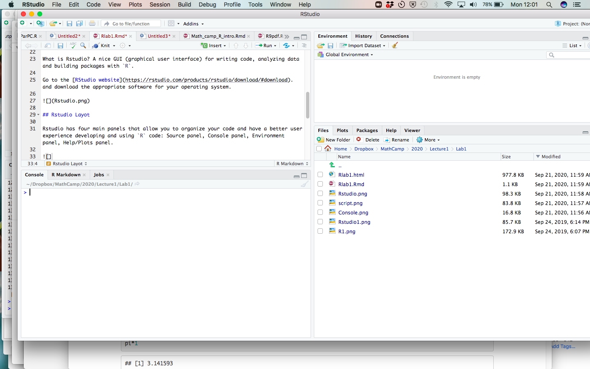
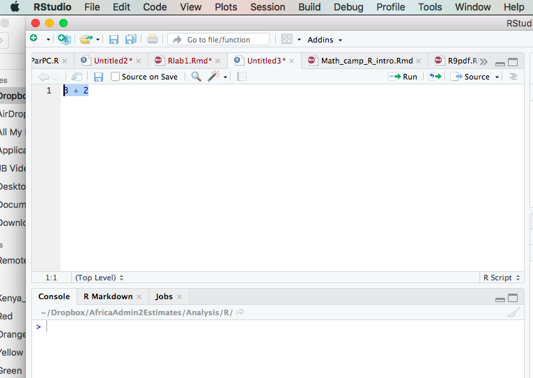
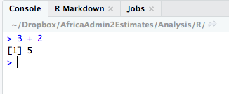

```{r setup, echo = FALSE}
knitr::opts_chunk$set(echo = TRUE)
knitr::opts_knit$set(root.dir = paste0("~/Dropbox/Workshops/",
                                       "IntrotoRI"))
```

# Getting started

## Download R

What is `R`? Open-source, free, statistical computing software.

Go to the [R website](https://cran.r-project.org/), and download the appropriate software for your operating system.


## Download RStudio

What is Rstudio? A nice GUI (graphical user interface) for writing code, analyzing data and building packages with `R`.

Go to the [RStudio website](https://rstudio.com/products/rstudio/download/#download). and download the appropriate software for your operating system.


## Rstudio Layout

Rstudio has four main panels that allow you to organize your code and have a better user experience developing and using `R` code:

-   Source panel: where scripts are edited
-   Console panel: where code is executed and output is printed
-   Environment panel: where objects are stored
-   Files/Plots/Help: navigate files and folders, view plots, read and access help documentation for packages and functions



# R as a calculator

Open a new .R script by clicking File $\rightarrow$ New File $\rightarrow$ R Script. We can execute code by highlighting it in a source file and clicking the run button.\


We can also execute code by typing it directly into the console and pressing enter. 



We can do basic mathematical computations using +,-, \*, /, and ().\

Note: `pi` is hard coded into `R`.\

```{r, eval = T, echo = T}
2+3
6*7
pi*1  
6*3/2-3
6*3/(2-3)
1/0
```

Try some on your own!\

What about more complicated functions like exponents, square roots, trig functions and the natural logarithm?\

```{r, echo = T, eval = T}
3^2
2^(3+2)
sqrt(9)
sin(2*pi)
log(1000)  
exp(6.907755)   
```

Note: \texttt{log()} computes the natural logarithm. See \texttt{?log} to compute a logarithm with a different base.\

# Documentation

One convenient feature in \texttt{R} is the documentation for all functions. If you want to learn more about a function and its arguments you can simply type a question mark in front of the function name or use the \texttt{help()} function.

```{r, echo = T, eval = F}
?log
help("log")
```

**Question** According to the above help files, what function (or functions) would you need to use for a base 10 logarithm?

There are a few other functions that can help you understand how to use functions or recall their arguments.

```{r, echo = T, eval = F}
help.search("log")
args(log)
```

# Objects in R

R is an object oriented programming language. Numbers, formulas, functions and other statistical information are stored as objects in R.\

Objects are given names and then are stored in the working environment. Once they are stored, the information remains "hidden" until referenced again. If you are using RStudio the object names can be seen in the Environment module.\

Notes:

-   Object names are case-sensitive
-   Object names should be meaningful and short (\`\`best practice'')
-   `<-` is most common, but `=` is acceptable

All R objects are given a class. The class of the object governs how it interacts with other objects.

```{r, eval = T, echo = T}
x <- 2 #Creates the object "x"
x    #Shows the contents of object "x"

y = 3.5
y

h <- "practice"   #You can also put strings in an object
h
```

Examples of `R` object types:

-   data: logical, numeric, integer, complex, character, raw
-   data structures: atomic, vector, matrix, list, data.frame
-   formula
-   function

## Data types
The most atomic object in R will exist having one of those data types, described below. An atomic object of the data type can have a value, `NA` which represents an observation with no data (e.g., a missing measurement), or `NULL` which isn't really a value at all, but can still have the data type class.

You will encounter other data types, such as `Date` or `POSIXct` if you are working with dates or time stamps. These other data types are extensions of the fundamental data types.

To determine what data type an object is, use `is(obj)`, `str(obj)`, or `class(obj)`.

```{r}
print(is("a"))

print(str(TRUE))

print(class(123.45))

print(class(as.integer(1000)))

n <- as.numeric(999999999999999999999)

print(class(n))
```

### Logical

Use `logical` values for characteristics that are either `TRUE` or `FALSE`. Note that if `logical` elements can also have an `NA` value if the observation is missing. In the following examples,

```{r}
# evaluate as logical, test whether 1 is greater than two
a <- 1 > 2
```

```{r}
# create two numerical values, one being NA, representing ages
age_john <- 39
age_jane <- NA

# logical NA from Jane's undefined age
(jo <- age_john > 50)
(ja <- age_jane > 50)
```

Logical values are often expressed in binary format as 0 = `FALSE` and 1 =`TRUE\`. In R these values are interconvertible. Other software (e.g., Excel, MS Access) may convert logical values to numbers that you do not expect.

```{r}
(t <- as.logical(1))
(f <- as.logical(0))
```

### Numeric

`Numeric` values are numbers with range about 2e-308 to 2e+308, depending on the computer you are using. You can see the possible range by entering `.Machine` at the R console. These can also include decimals. For more information, see [Double-precision floating-point format](https://en.wikipedia.org/wiki/Double-precision_floating-point_format)

### Integer

`Integer` values are numerical, but can only take on whole, rather than fractional values, and have a truncated range compared to `numeric`. For example, see below, if we try to create an integer that is out of range. The object we created is an integer, but because it is out of range, is value is set to `NA`.

```{r}
i <- as.integer(999999999999999999999)

print(class(i))
```

### Complex

The `complex` type is used in mathematics and you are unlikely to use it in applied social science research unless you get into some heavy statistics. See [Complex number](https://en.wikipedia.org/wiki/Complex_number) for a full treatment.

### Character

`Character` data include the full set of keys on your keyboard that print out a character, typically [A-Z], [a-z], [0-9], punctuation, etc. The full set of ASCII characters is supported, e.g. the `accent aigu` in Café:

```{r}
print(class("Café"))
```

Also numbers can function as characters. Be careful in converting between numerical and character versions. For example, see these ZIP codes:

```{r error=TRUE}
# this is a character
my_zip <- "98115"

# it is not numeric.
my_zip + 2
```

```{r}
# we can convert it to numeric, although it would be silly to do with ZIP codes, which are nominal values
as.numeric(my_zip) + 2

# Boston has ZIP codes starting with zeros
boston_zip <- "02134"
as.numeric(boston_zip)
```

### Raw

`Raw` values are used to store raw bytes in hexadecimal format. You are unlikely to use it in applied social science research. For example, the hexadecimal value for the character `z` is `7a`:

```{r}
print(charToRaw("z"))

class(charToRaw("z"))
```

## R data structures {#rdatastructures}

There are 5 basic data structures in R, as shown in the graphic:

1.  vector
2.  matrix
3.  array
4.  data frame
5.  list


In addition, the `factor` data type is very important

### Vector

A vector is an ordered set of elements of one or more elements of the same data type and are created using the `c()` constructor function. For example, a single value is a vector:

```{r}
# create a vector of length 1
a <- 1
is(a)
```

#### rep()

We can create a vector with repeated numbers.

```{r}
help(rep)

z <- rep(1,5)
z

q <- rep(c(1, 2), 5)
q

t <- rep(c(1,2), c(5, 5))
t
```

#### seq()

We can create a vector with a sequence of numbers.

```{r}
help(seq)

a <- 1:5
a

b <- seq(1,5)
b

c <- seq(5,1)
c

d <- seq(from=0, to=15, by=3)
d

e <- seq(0, 15, 3)
e
```

If you try creating a vector with mixed data types, you may get unexpected results; mixing character elements with other type elements will result in character representations, e.g.,

```{r}
c(1, "a", TRUE, charToRaw("z"))
```

Results will depend on the data type you are mixing, for example because logical values can be expressed numerically, the `TRUE` and `FALSE` values are converted to `1` and `0`, respectively.

```{r}
(c(1:3, TRUE, FALSE))
```

But if a character is added, all elements are converted to characters.

```{r}
c(1:3, TRUE, FALSE, "awesome!")
```

Order is important, i.e.,

`1, 2, 3` is not the same as `1, 3, 2`

R will maintain the order of elements in vectors unless a process is initiated that changes the order of those elements:

```{r}
# a vector 
(v <- c(1, 3, 2))

(sort(v))
```

You can get some information about vectors, such as length and data type:

```{r}
# create a random normal 
set.seed(5)
normvec100 <- rnorm(n = 100)

length(normvec100)
class(normvec100)
class(normvec100 > 1)
```

Elements of vectors are specified with their index number (1 .. n):

```{r}
v <- seq(from = 0, to = 10, by = 2)
v[4]
```

The index number can extracted based on a specific criteria and used to designate elements in the vector you want to change

```{r}
v <- seq(from = 0, to = 10, by = 2)
v

which(v > 5)

v[which(v > 5)] <- 100
v

```

Many of `R`'s statistics functions take vectors as arguments.

```{r}
mean(v)
sd(v)
```

### Matrix

A matrix is like a vector, in that it can contain only one data type, but it is two-dimensional, having rows and columns. There are many ways to use the `matrix()` function to create a matrix.

```{r}
# make a vector 1 to 100
(v <- 1:100)

# load to a matrix
(m1 <- matrix(v, ncol = 10, byrow = TRUE))

# different r, c ordering
(m2 <- matrix(v, ncol = 10, byrow = FALSE))
```

If you try to force a vector into a matrix whose row $\times$ col length does not match the length of the vector, the elements will be recycled, which may not be what you want. At least R will give you a warning.

```{r}
(m3 <- matrix(letters, ncol = 10, nrow = 10))
```


Let's create a matrix of zeroes and add 1's to the diagonal.

```{r}
matrix.zero <- matrix(0, nrow=5, ncol=5)
matrix.zero

diag(matrix.zero) = 1
matrix.zero
```

Similarly to finding the length of a vector, we often want to find the dimensions of a matrix

```{r}
dim(matrix.zero)
```

#### Subsetting a matrix

To isolate or look at parts of a matrix we will still use brackets [ ], but now we have two dimensions.

```{r,}
z <- 1:30
matrix.z <- matrix(z, ncol=5)
matrix.z

#Display only the fifth row of matrix.a
matrix.z[5, ]  

#Display only the third column
matrix.z[ , 3] 

#Display the third and fourth columns
matrix.z[ , 3:4]

#Display the second and fourth columns
matrix.z[ , c(2,4)]

#Display the first and fifth rows
matrix.z[c(1,5), ]

#Change the value/s of an element or elements in the matrix
#Change all of column 1 to zeros
matrix.z[ , 1] = 0
matrix.z

#Change all of row 3 to 50
matrix.z[3, ] = 50
matrix.z

#Change row 1, column 4 to 999
matrix.z[1, 4] = 999
matrix.z
```

We can also create a new matrix by combining columns or rows from a pre-existing matrix. The command cbind combines columns, and the command rbind combines rows.\

Note: You need to have the same number of columns to use cbind, and rows to use rbind.

```{r}

matrix.a <- matrix(1:25, nrow=5)
matrix.a

matrix.b <- matrix(50:74, nrow=5)
matrix.b

#Combine matrix a and b by column.
matrix.c <- cbind(matrix.a, matrix.b)
matrix.c

#Combine matrix a and b by row.
matrix.d <- rbind(matrix.a, matrix.b)
matrix.d

#Combine column 1 in matrix a with column 1 of matrix b.
matrix.col1 <- cbind(matrix.a[,c(1)],
                     matrix.b[,c(1)])
matrix.col1

#Combine row 5 in matrix a with row 3 in matrix b.
matrix.row <- rbind(matrix.a[c(5),], 
                    matrix.b[c(3),])
matrix.row
```

#### Mathematical operations using matrices

First we will go over addition and subtraction. Recall, we can only add and subtract matrices with the same number of dimensions.

```{r}
matrix.a <- matrix(1, ncol=5, nrow=5)
matrix.a

matrix.b <- matrix(5, ncol=5, nrow=5)
matrix.b

matrix.a - matrix.b
matrix.b - matrix.a
matrix.a + matrix.b
```

#### Matrix multiplication

To multiply matrices we need the left matrix to have the same number of columns as the number of rows in the right matrix. Instead of \* we use %\*% to multiply matrices.\

Take note of what happens when we try to do the following operations:

-   $CD$: `matrix.c \%*\% matrix.d`
-   $DC$: `matrix.d \%*\% matrix.c`

```{r}
matrix.c <- matrix(3, ncol=4, nrow=5)
matrix.c

dim(matrix.c)

matrix.d <- matrix(7, ncol=5, nrow=3)
matrix.d

dim(matrix.d)
```

```{r, eval = F}

matrix.c %*% matrix.d 

matrix.d %*% matrix.c
```

##### Practice 1: Vectors & Matrices

-   Create a vector with the numbers 0-20 sequenced by 5. What is the length of the vector?
-   Create a vector that draws 20 random numbers from a normal distribution with a mean of 0 and a standard deviation of 1. Is the mean of this vector zero?
-   Create a matrix that includes the numbers 1-6, with the following dimensions: $2 \times 3$. What number is in the first row, second column?
-   Create another matrix (give it a different name) that includes the numbers 1-6 with the following dimensions: $3 \times 2$
-   Use R to multiply the matrices that you created in a) and b) and check your results.

### Array

An array is similar to matrix, but it can have more than one dimension. These can be useful for analyzing time series data or other multidimensional data. A simple example of creating and viewing the contents of an array:

```{r}
# a vector 1 to 27
v <- 1:27

# create an array, 3 x 3 x 3
(a <- array(v, dim = c(3, 3, 3)))

# array index is r, c, m (row, column, matrix), e.g., row 1 column 2 matrix 3:
(a[1,2,3])
```

### List

R lists are ordered collections of objects that do not need to be of the same data type. Those objects can be single-value vectors, multiple-value vectors, matrices, data frames, other lists, etc. Because of this, lists are a very flexible data type. But because they can have as little or as much structure as you want, can become difficult to manage and analyze.

Here is an example of a list comprised of single value vectors of different data type. Compare this with the attempt to make a vector comprised of elements of different data type:

```{r}
(l <- list("a", 1, TRUE))
```

Let's modify that list a bit:

```{r}
(l <- list("a", 
           1:20, 
           as.logical(c(0,1,1,0))))
```

The top-level indexing for a list is denoted using two sets of square brackets. For example, the first element of our list can be accessed by `l[[1]]`. For example, the mean of element 2 is obtained by `mean(l[[2]])`: `r mean(l[[2]])`.

To perform operations on all elements of a list, use `lapply()`:

```{r}
# show the data types
(lapply(X = l, FUN = class))

# mean, maybe?
(lapply(X = l, FUN = function(x) {mean(x)}))
```

### Factor

Factors are similar to vectors, in that they are one-dimensional ordered sets. However, factors also use informational labels. For example, you may have a variable with household income as a text value:

-   "\<\$10,000"
-   "\$10,000-\$549,999"
-   "\$50,000-\$99,999"
-   "\$100,000-\$200,000"
-   "\>\$200,000"

As a vector:

```{r}
(income <- c("<$10,000"
, "$10,000-$49,999"
, "$50,000-$99,999"
, "$100,000-$200,000"
, ">$200,000"))
```

Because these are characters, they do not sort in proper numeric order:

```{r}
sort(income)
```

If these are treated as a factor, the levels can be set for proper ordering:

```{r}
# create a factor from income and set the levels
(income_factor <- factor(x = rep(income, 2), levels = income))

# sort again
(sort(income_factor))
```

### Data frame
Other than vectors, data frames are probably the most used data type in R. You can think of data frames as matrices that allow columns with different data type. For example, you might have a data set that represents subject IDs as characters, sex or gender as text, height, weight, and age as numerical values, income as a factor, and smoking status as logical. Because a matrix requires only one data type, it would not be possible to store all of these as a matrix. An example:

```{r}
# income levels 
inc <- c("<$10,000"
, "$10,000-$49,999"
, "$50,000-$99,999"
, "$100,000-$200,000"
, ">$200,000")

BMI <-  data.frame(
   sid = c("A1001", "A1002", "B1001"),
   gender = c("Male", "Male","Female"), 
   height_cm = c(152, 171.5, 165), 
   weight_kg = c(81, 93, 78),
   age_y = c(42, 38, 26),
   income = factor(c("$50,000-$99,999", "$100,000-$200,000", "<$10,000"), levels = inc)
)
print(BMI)
```
## The environment

The function \texttt{ls()} will list all of the objects that have been created:

```{r, echo = T, eval = T}
ls()
```

Here we see we have in our environment the objects we created \texttt{x, y, h}. If we assign a new value to \texttt{x} it will overwrite what is already stored in that object

```{r}
x     #Original object that we created above.
x <- 7  #New object with same name
x     #New object
```

Sometimes you will want to clear every object you've stored in your environment. This is done using the `rm()` function.

```{r}
rm(list=ls())
```


# Functions {#rfunc}

Functions are sets of statements in R that are grouped together to perform a specific task or set of tasks. Functions are either built in, included in packages, or user-defined. Functions are used mainly to simplify running a series of individual commands or functions, for situations where the same process will need to be run multiple times on different inputs, or when control structures are needed (e.g., looping, logical branching).

The different parts of a function are:

1.  (Usually) Name: This is the actual name of the function. It is stored in an R environment as an object with this name.
2.  (Optional) Arguments: Arguments specify the inputs or options to the function. When a function is invoked, you pass a value to the argument. Arguments are optional; that is, a function may contain no arguments. Also arguments can have default values.
3.  Body: The function body contains a collection of statements that defines what the function does.
4.  Return value: The return value of a function is the last expression in the function body to be evaluated.

## Name

Most functions are created with code of the form

```         
function_name <- function(argument(s)){
    statement(s)
}
```

For example, to square a vector of numerical values:

```{r}
f_square <- function(x){
    x^2
}
```

the function name is `f_square`.
## Arguments

Most functions require arguments. Arguments are used to instantiate variables within the function's environment that can be used later in the body of the function. Each argument is named, and the name is used within the function as a local variable within the function's environment.

Following our example from above, `f_square` takes an argument named "x" that is a numeric vector.

Here, let's modify the function to demonstrate that within the environment of the function, `x` is a variable by using `print(x)`:

```{r}
f_square_2 <- function(x){
    message("input:")
    print(x)
    message("output:")
    x^2
}

f_square_2(c(1,2,3))
```

### The `...` argument

When functions do not have a known *a priori* number or set of arguments, or when a large number of arguments is to be passed to another function the `...` argument is used. We will not cover this here, but you are encouraged to read more: [How to Use the Dots Argument in R](https://www.dummies.com/programming/r/how-to-use-the-dots-argument-in-r/); [The three-dots construct in R](https://www.r-bloggers.com/2013/01/the-three-dots-construct-in-r/).

## Body

The function's body contains all of the code to perform the purpose of the function. Following our initial example, the body of the function is simply

```{r eval=FALSE}         
x^2
```

The body can be as simple or complicated as it needs to be in order to achieve the desired result.

Here we run with the default option `verbose = FALSE`; only the final value `x^2` is in the output:

```{r}
f_square_3 <- function(x, verbose = FALSE){
    # only run the next lines if verbose is true
    if(verbose){
        message("input:")
        print(x)
        message("output:")
    }
    x^2
}

f_square_3(x = c(1,2,3))
f_square_3(x = c(1, 2, 3), verbose = TRUE)
```

... and with `verbose = TRUE`, additional text is printed :

```{r}
f_square_3(x = c(1, 2, 3), verbose = TRUE)
```

## Return value

The return value is either the last evaluated expression in the function or an object specified using the `return()` function. For functions that are intended to return only one value, by convention that is the last line in the function.

In our original `f_square()` function, the return value is `x^2` since no other `return()` value was specified, e.g., for a vector of one element:

```{r}
f_square <- function(x){
    x^2
}
f_square(3)
```

or a vector with multiple elements:

```{r}
f_square(c(1,2,3))
```

However, if it is possible that different outputs can be produced by a function based on some logical testing, one can explicitly use `return(object)` in the code; at that time the object will be output and the function will stop. A simple example of explicitly specifying return values is shown in this numerical comparison function:

```{r}
f_compare <- function(x, y){
    # either missing?
    if(nargs() != 2)
        return("invalid number of arguments")
    # numeric?
    if(!is.numeric(x) | !is.numeric(y)){
        return(sprintf("%s or %s is not numeric.", x, y))
    }
    # comparisons follow
    if(x > y){
        return(sprintf("%s is greater than %s", x, y))
    } 
    if(x < y) {
        return(sprintf("%s is less than %s", x, y))
    }
    if(x == y){
        return(sprintf("%s equals %s", x, y))
    }
}
```

Based on criteria such as the number of arguments or the relative value of the arguments `x` and `y`, different outputs are generated. Here are a few examples running the function:

```{r}
f_compare(1)

f_compare(1, 2)

f_compare(2, 1)
```


# Looping

Loops are run when you want to perform a series of tasks over and over on a set of objects.

## Looping with `for()` loops

A for loop is constructed using the form ...

```         
for (element in set){
    do something
}
```

where `element` represents the variable value of the current iteration and `set` is a group of objects, such as elements in a vector or list

A few simple examples follow.

Print each letter in the first 5 letters of the alphabet. In this example, the iterated element is a letter, and the variable `i` has the value of the letter in each iteration. The built in vector `letters` is used. So on the first iteration, `i = 1`, on the second iteration, `i = 2` and so on.

```{r}
for (i in head(letters, 5)){
    print(i)
}
```

In this example, the object `i` takes on integer values 1 through 10. Within the loop, a message is printed that includes the term `i^2`, which evaluates to `1^2`, `2^2`, $\dots$, `10^2`.

```{r}
for(i in 1:10){
    message(paste(i, "squared equals", i^2))
}
```

Here is a similar approach, but using a numerical index referring to the position within a vector. The vector to be iterated over is `1:length(states_5)`, which evaluates to `r 1:length(head(state.name, 5))`. In each iteration, we print the index of the iterator and the state name.

```{r}
# take the first 5 state names
states_5 <- head(state.name, 5)

# iterate over those
for (i in 1:length(states_5)){
    s <- states_5[i]
    message(paste0(i, ": ", s))
}
```

## Looping with `while()` loops

A for loop is constructed using the form ...

```         
while (condition is met){
    do something
}
```

where `condition` represents a logical test or expression and the `condition is met` when the Boolean test returns the value `TRUE`.

Let's print out numbers of the Fibonacci sequence below 100. The Fibonacci sequence begins with the numbers 1, 1, and then every term after that is the sum of the two terms before it. Formally, 

$$a_1 = 1$$
$$a_2 = 1$$
$$a_n = a_{n-1} + a_{n-2}$$


```{r while}
## Create vector with two initial terms.
sequence <- c(1, 1)

print(sequence[1])
print(sequence)
while(sequence[length(sequence)] +
          sequence[length(sequence) - 1] < 100){
  term_no <- length(sequence) + 1
  
  sequence <- c(sequence,
                sequence[term_no - 1] + sequence[term_no - 2])
  print(sequence)
}

```
